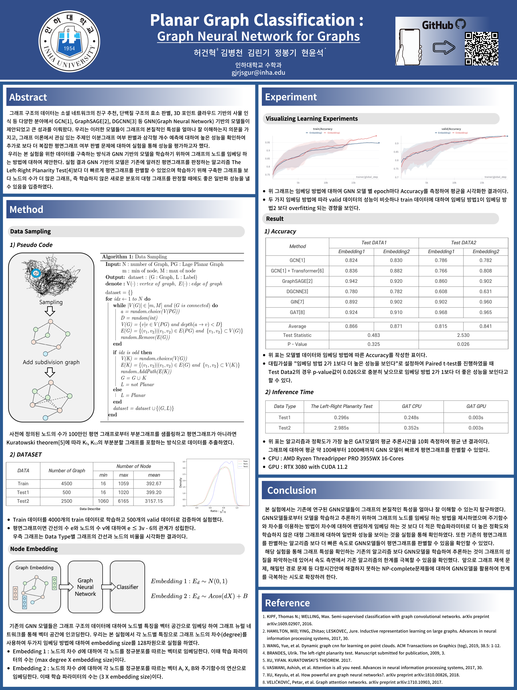

# Planar Graph Classification : Graph Neural Network for Graphs

## 📖 프로젝트 요약

- 문제 정의
    - 그래프 신경망이 그래프의 본질적인 특성을 얼마나 잘 이해하는지 의문을 가지고 그래프 이론에서 관심 있는 주제 중 하나인 평면그래프 여부 판별에 대하여 실험을 통해 성능을 평가하고자 했습니다.
- 실험 설계
    - 노드별 특징으로 그래프 노드의 차수(degree)를 사용하여 두 가지 임베딩 방법에 대하여 그래프 신경망을 학습해 정확도를 측정하였습니다.
    - 임베딩 방법1은 노드의 차수에 대하여 임베딩 하는 방법입니다.
    - 임베딩 방법2는 노드의 차수와 주기함수를 통하여 임베딩 하는 방법입니다.
- 가설 검정
    - 가설 : 임베딩 방법2는 방법1과 다르게 주기함수를 통해 차수 간의 관계를 학습하여 학습하지 않은 차수의 노드를 갖는 그래프에 대하여 성능이 더 좋을 것이라고 생각했습니다.
    - 검정 : 6가지의 그래프 신경망을 통해 테스트 데이터에 대하여 Accuracy를 측정하여 Paired t-test를 진행하였고 학습하지 않은 새로운 대형 그래프를 판별할 때 두 번째 임베딩 방식이 더 좋은 일반화 성능을 낼 수 있음을 입증하였습니다.
- 결론
    - 그래프 신경망을 통하여 그래프의 성질을 파악하는 것은 기존의 알고리즘보다 더 빠른 속도로 성질을 파악할 수 있었습니다.
    따라서 다항 시간 안에 해결하지 못하는 채색 문제, 해밀턴 경로 문제 등 NP-Complete 들에 대하여 노드의 임베딩을 주기함수의 합으로 표현되는 푸리에 급수의 형태로 표현력을 키워 기존의 NP-Complete 문제들을 극복하는 시도로 확장이 가능하다 생각한다.

## 📘Poster
- Mathematical Intelligence Lab에서 학부연구생 활동을 하면서 GNN이 그래프의 본질을 이해할 수 있는지 연구한 내용입니다. \
단독 1저자로 연구하였으며 2024 [KSIAM](https://ksiam.org/) 춘계학술대회에서 아래의 포스터를 발표해 포스터 우수상을 수상하였습니다.

## Command

### ⭐️Data Sampling
~~~
1. data폴더에 planar_embedding1000000.pg 저장
   (http://www.inf.udec.cl/~jfuentess/datasets/graphs.php)

2. python src/DataSampling.py --min_node {m} --max_node {M} --N {N} --LargePlanarGraph {PG}
~~~

### ⭐️Model Train
- [model list](lightning-hydra-template/configs/model)
~~~
1. cd lightning-hydra-template
2. python src/train.py model={model name}
   (option) logger=wandb logger.wandb.name={model log name}
~~~

## ⭐️Inference Time Test
~~~
1. cd lightning-hydra-template
2. python src/test.py model={model name}
~~~
